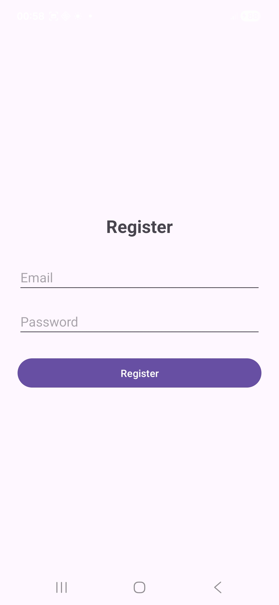
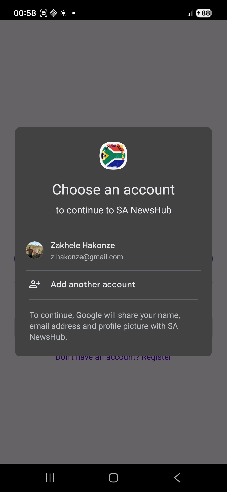
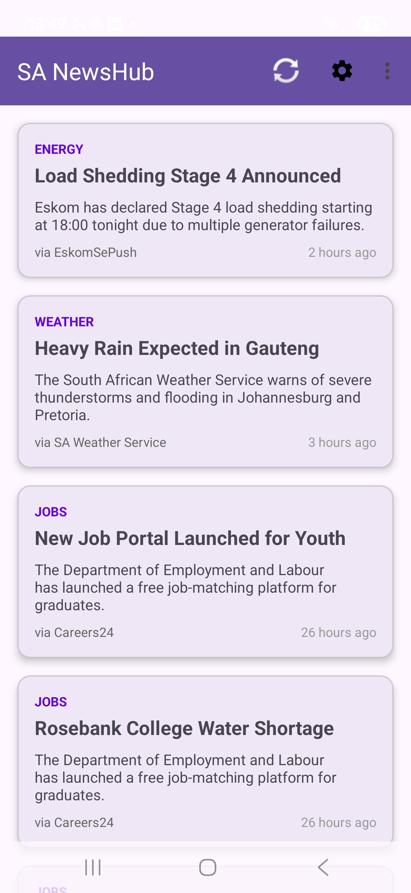
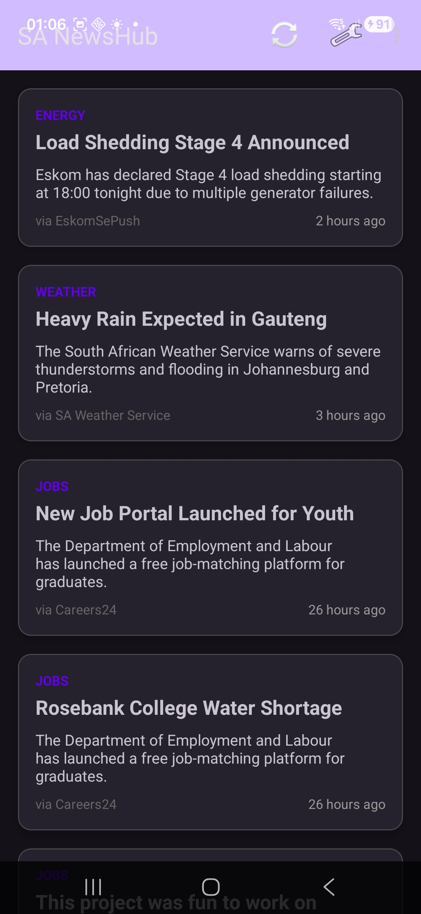
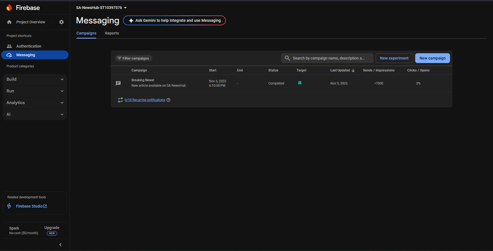
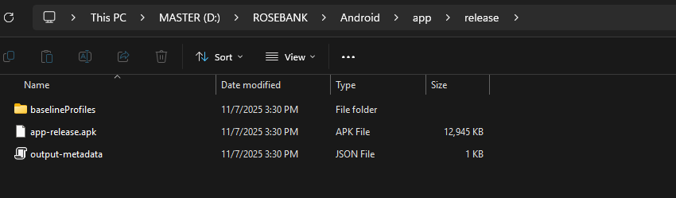
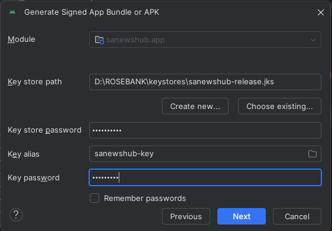

# 🇿🇦 SA NewsHub - South African News Application


**Student:** Zakhele Hakonze  
**Student Number:** ST10397576  
**Module:** OPSC6312 - Mobile Application Development  
**Institution:** IIE Rosebank College  
**Submission:** Part 3 - Final POE

---

[](https://github.com/ST10397576-ZAKHELE-HAKONZE/SA-NewsHub/actions)

##  About SA NewsHub 

SA NewsHub is a comprehensive Android news application tailored for South African users, delivering personalized local and national news with multi-language support and offline capabilities. Built for South Africans to stay informed about load shedding, weather alerts, job opportunities, and community updates — even in low-connectivity areas.

###  Key Features

- ** Secure Authentication**
  - Email/Password registration and login with BCrypt encryption
  - Google Single Sign-On (SSO) integration
  - Firebase Authentication backend
  - Secure logout with session clearing

- ** Multi-Language Support**
  - English
  - Afrikaans
  - isiZulu
  - Seamless language switching across entire app

- ** News Management**
  - Real-time news updates via REST API
  - Offline reading with local database (Room)
  - Background synchronization (WorkManager)
  - Region-specific news filtering (All Provinces)

- ** Push Notifications**
  - Firebase Cloud Messaging (FCM)
  - Breaking news alerts
  - Real-time updates

- ** User Settings**
  - Dark/Light theme toggle
  - Language preferences
  - Regional news selection
  - Persistent settings across sessions

- ** Offline-First Architecture**
  - Local caching with Room Database
  - Automatic background sync
  - Works without internet connection

---

## 🔐 Authentication & Security

### **User Authentication Flow**

SA NewsHub implements a comprehensive authentication system with multiple sign-in options and secure session management.

#### **Registration & Login Options:**
1. **Email/Password Authentication**
   - Passwords encrypted with BCrypt on server-side
   - Firebase Authentication for session management
   - Minimum 6-character password requirement

2. **Google Single Sign-On (SSO)**
   - One-tap Google account integration
   - OAuth 2.0 secure token exchange
   - Automatic profile data retrieval

#### **Session Management:**
- Firebase automatically persists user sessions
- Users remain logged in across app restarts
- Secure token-based authentication
- Automatic token refresh

#### **Logout Functionality:**

**Why Logout is Important:**

While Firebase Authentication provides automatic session persistence for user convenience, a logout feature is essential for:

1. **Security:** Allows users to sign out on shared devices
2. **Account Switching:** Enables users to switch between multiple accounts
3. **Privacy:** Users can end their session when needed
4. **Testing & Demonstration:** Facilitates showcasing the complete authentication flow

**Logout Implementation:**

The logout feature performs the following actions:
```kotlin
private fun logout() {
    // 1. Sign out from Firebase Authentication
    FirebaseAuth.getInstance().signOut()
    
    // 2. Sign out from Google (clears SSO session)
    googleSignInClient.signOut()
    
    // 3. Clear local app settings (optional)
    getSharedPreferences("AppSettings", MODE_PRIVATE).edit().clear().apply()
    
    // 4. Navigate to Login screen and clear back stack
    val intent = Intent(this, LoginActivity::class.java)
    intent.flags = Intent.FLAG_ACTIVITY_NEW_TASK or Intent.FLAG_ACTIVITY_CLEAR_TASK
    startActivity(intent)
    finish()
}
```

**Access Logout:**
- Open the app
- Tap the **three-dot menu** (⋮) in the top-right corner
- Select **"Logout"**
- User is signed out and returned to Login screen

**Security Benefits:**
- ✅ Clears Firebase authentication token
- ✅ Removes Google SSO credentials
- ✅ Prevents unauthorized access after logout
- ✅ Clears back navigation stack (can't press back to return)

---

##  Demo Video

[](https://youtu.be/Coa74ugiHNE)

>  **[Click here to watch the full demo video (unlisted)](https://youtu.be/Coa74ugiHNE)**  

*Video includes:*
- Complete app navigation
- Authentication flows (Email/Password & Google SSO)
- Multi-language switching demonstration
- Dark mode toggle
- Push notification testing
- Offline mode demonstration
- All Part 3 requirements

---

##  Screenshots

### Authentication & Onboarding
<table>
  <tr>
    <td><br/><b>Login Screen</b></td>
    <td><br/><b>Registration</b></td>
    <td><br/><b>Google SSO</b></td>
  </tr>
</table>

### Home & News Feed
<table>
  <tr>
    <td><br/><b>Home (Light Mode)</b></td>
    <td><br/><b>Home (Dark Mode)</b></td>
    <td><br/><b>News List</b></td>
  </tr>
</table>

### Multi-Language Support
<table>
  <tr>
    <td><br/><b>English</b></td>
    <td><br/><b>Afrikaans</b></td>
    <td><br/><b>isiZulu</b></td>
  </tr>
</table>

### Settings & Notifications
<table>
  <tr>
    <td><br/><b>Settings Screen</b></td>
    <td><br/><b>Push Notification</b></td>
    <td><br/><b>Firebase Console</b></td>
  </tr>
</table>

### GitHub Actions CI/CD
<table>
  <tr>
    <td><br/><b>Actions Overview</b></td>
    <td><br/><b>Successful Build</b></td>
  </tr>
</table>

### App Icon & Branding
<table>
  <tr>
    <td><br/><b>Custom SA Icon</b></td>
    <td><br/><b>On Device</b></td>
  </tr>
</table>

*All screenshots taken on Samsung Galaxy A26 running Android 16*

---

##  Technical Architecture

### **Frontend (Android App)**
- **Language:** Kotlin 1.9.0
- **UI Framework:** Material Design 3, XML layouts
- **Architecture Pattern:** MVVM (Model-View-ViewModel)
- **Min SDK:** 24 (Android 7.0 Nougat)
- **Target SDK:** 34 (Android 14)
- **Build System:** Gradle with Kotlin DSL

### **Backend (REST API)**
- **Runtime:** Node.js 18+
- **Framework:** Express.js 4.18
- **Database:** 
  - Production: MongoDB Atlas (Cloud)
  - Development: SQLite (Local)
- **Authentication:** BCrypt for password hashing
- **Hosting:** Render.com (Free Tier)
- **API Base URL:** `https://sahub-api.onrender.com`

### **Cloud Services**
- **Firebase Authentication:** User management
- **Firebase Cloud Messaging:** Push notifications
- **Google Sign-In:** OAuth 2.0 integration
- **GitHub Actions:** CI/CD pipeline
- **MongoDB Atlas:** Cloud database hosting

### **Key Libraries & Versions**
```gradle
dependencies {
    // Core Android
    implementation 'androidx.core:core-ktx:1.12.0'
    implementation 'androidx.appcompat:appcompat:1.6.1'
    implementation 'com.google.android.material:material:1.11.0'
    
    // Firebase
    implementation platform('com.google.firebase:firebase-bom:32.7.0')
    implementation 'com.google.firebase:firebase-auth-ktx'
    implementation 'com.google.firebase:firebase-messaging-ktx'
    
    // Google Sign-In
    implementation 'com.google.android.gms:play-services-auth:20.7.0'
    
    // Room Database
    implementation 'androidx.room:room-runtime:2.6.1'
    implementation 'androidx.room:room-ktx:2.6.1'
    kapt 'androidx.room:room-compiler:2.6.1'
    
    // Networking
    implementation 'com.squareup.retrofit2:retrofit:2.9.0'
    implementation 'com.squareup.retrofit2:converter-gson:2.9.0'
    implementation 'com.squareup.okhttp3:okhttp:4.12.0'
    implementation 'com.squareup.okhttp3:logging-interceptor:4.12.0'
    
    // WorkManager
    implementation 'androidx.work:work-runtime-ktx:2.9.0'
    
    // Coroutines
    implementation 'org.jetbrains.kotlinx:kotlinx-coroutines-android:1.7.3'
    implementation 'org.jetbrains.kotlinx:kotlinx-coroutines-core:1.7.3'
    
    // Lifecycle
    implementation 'androidx.lifecycle:lifecycle-viewmodel-ktx:2.7.0'
    implementation 'androidx.lifecycle:lifecycle-livedata-ktx:2.7.0'
}
```

---

##  Project Structure
```
SA-NewsHub/
├── .github/
│   └── workflows/
│       └── android.yml          
├── app/
│   ├── src/
│   │   ├── main/
│   │   │   ├── java/com/st10397576/sanewshub/
│   │   │   │   ├── LoginActivity.kt
│   │   │   │   ├── RegisterActivity.kt
│   │   │   │   ├── HomeActivity.kt
│   │   │   │   ├── SettingsActivity.kt
│   │   │   │   ├── MyFirebaseMessagingService.kt
│   │   │   │   ├── GoogleSignInHelper.kt
│   │   │   │   ├── database/
│   │   │   │   │   ├── NewsDatabase.kt
│   │   │   │   │   ├── NewsDao.kt
│   │   │   │   │   └── NewsEntity.kt
│   │   │   │   ├── repository/
│   │   │   │   │   └── NewsRepository.kt
│   │   │   │   ├── api/
│   │   │   │   │   ├── ApiHelper.kt
│   │   │   │   │   └── ApiService.kt
│   │   │   │   └── worker/
│   │   │   │       └── NewsSyncWorker.kt
│   │   │   ├── res/
│   │   │   │   ├── values/
│   │   │   │   │   └── strings.xml
│   │   │   │   ├── values-af/
│   │   │   │   │   └── strings.xml
│   │   │   │   └── values-zu/
│   │   │   │       └── strings.xml
│   │   │   └── AndroidManifest.xml
│   │   └── google-services.json
│   └── build.gradle.kts
├── server/
│   ├── server.js
│   └── package.json
├── screenshots/                  
├── README.md
├── RELEASE_NOTES.md
└── AI_USAGE.md
```

---

##  Setup & Run

### **Prerequisites**
- Android Studio (Hedgehog | 2023.1.1 or later)
- JDK 17
- Physical Android device (min SDK 24 / Android 7.0)
- Internet connection

### **Steps**

1. **Clone Repository:**
```bash
   git clone https://github.com/ST10397576-ZAKHELE-HAKONZE/SA-NewsHub.git
   cd SA-NewsHub
```

2. **Open in Android Studio:**
   - Launch Android Studio
   - File → Open → Select SA-NewsHub folder
   - Wait for Gradle sync to complete

3. **Firebase Setup:**
   - Create Firebase project at [console.firebase.google.com](https://console.firebase.google.com)
   - Add Android app with package name: `com.st10397576.sanewshub`
   - Download `google-services.json`
   - Place in `app/` directory
   - Enable Authentication (Email/Password & Google)
   - Enable Cloud Messaging

4. **Build & Run:**
   - Connect Android device or start emulator
   - Click **Run** (▶️) button
   - Select target device

5. **Test Features:**
   - Register a new account
   - Log in with credentials
   - Try Google SSO
   - View news feed
   - Change language and theme in settings
   - Test push notifications

---

##  Backend Architecture

| **Component** | **Technology**                | **URL / Details**                                                |
| ------------- | ----------------------------- | ---------------------------------------------------------------- |
| **API**       | Node.js + Express             | [https://sahub-api.onrender.com](https://sahub-api.onrender.com) |
| **Database**  | MongoDB Atlas (Free Tier)     | Cloud-hosted cluster                                             |
| **Hosting**   | Render.com (Free Web Service) | Auto-deploys from GitHub                                         |

### **Sample API Response (GET /api/news):**
```json
[
  {
    "id": 1,
    "title": "Load Shedding Stage 4 Announced",
    "body": "Eskom has declared Stage 4 load shedding starting at 18:00...",
    "category": "Energy",
    "timestamp": "2025-10-05T12:00:00Z",
    "source": "EskomSePush"
  }
]
```

### **API Endpoints:**
- `GET /api/news` → Returns news articles
- `POST /api/register` → Creates new user
- `POST /api/login` → Validates credentials

---

##  Testing

### **Manual Testing**
-  Registration with valid/invalid inputs
-  Login with email/password
-  Google SSO flow
-  Language switching (EN, AF, ZU)
-  Dark mode toggle
-  Offline mode (airplane mode)
-  Push notification reception
-  Background sync

### **Automated Testing (GitHub Actions)**

[](https://github.com/ST10397576-ZAKHELE-HAKONZE/SA-NewsHub/actions)

CI/CD pipeline runs on every push:
-  Build verification
-  Unit tests
-  APK generation
-  Artifact upload

---

##  Part 3 Requirements Checklist

### **Mandatory Features**
- [x] **Authentication System**
  - [x] Email/Password registration and login
  - [x] BCrypt password encryption on server
  - [x] Google Single Sign-On (SSO)
  - [x] Firebase Authentication integration
  - [x] Secure logout functionality

- [x] **Multi-Language Support**
  - [x] 3 languages implemented (English, Afrikaans, isiZulu)
  - [x] All UI elements localized
  - [x] Toast messages translated
  - [x] Settings persist across sessions

- [x] **Push Notifications**
  - [x] Firebase Cloud Messaging configured
  - [x] Notification service implemented
  - [x] Test notifications sent successfully
  - [x] Background notification handling

- [x] **Offline Mode**
  - [x] Room Database for local storage
  - [x] WorkManager for background sync
  - [x] Data persists without internet
  - [x] Graceful offline handling

- [x] **Settings Management**
  - [x] Dark/Light theme toggle
  - [x] Language selection
  - [x] Regional preferences
  - [x] SharedPreferences for persistence

- [x] **REST API Integration**
  - [x] Custom backend (Node.js + Express)
  - [x] Retrofit for API calls
  - [x] Coroutines for async operations
  - [x] Error handling implemented

- [x] **GitHub Actions CI/CD**
  - [x] Automated build pipeline
  - [x] Unit test execution
  - [x] APK artifact generation
  - [x] Successful workflow runs

### **Documentation**
- [x] Complete README.md with setup instructions
- [x] RELEASE_NOTES.md with feature descriptions
- [x] AI_USAGE.md documenting AI tool usage
- [x] Code comments and logging throughout
- [x] Screenshots of all features

### **Submission Requirements**
- [x] Complete Kotlin source code on public GitHub
- [x] No zip files (all files in repository)
- [x] Comments and references in code
- [x] Logging statements for debugging
- [x] README with video link
- [x] Release notes with screenshots
- [x] Signed APK generated
- [x] Google Play Console screenshots
- [x] AI usage documentation (<500 words)
- [x] Video with voice-over uploaded to YouTube (unlisted)

---

##  Google Play Console - Publication Process

### Step 1: Generate Signed APK


**Process:**
1. Build → Generate Signed Bundle/APK
2. Select APK
3. Create/Select Keystore
4. Enter keystore credentials
5. Select release build variant
6. Generate APK

### Step 2: Keystore Configuration


**Keystore Details:**
- **Location:** `~/android-keystore/sanewshub-release.jks`
- **Alias:** `sanewshub-key`
- **Validity:** 25 years
- **Algorithm:** RSA 2048-bit

### Step 3: Google Play Console Setup


**Created:**
- App name: SA NewsHub
- Default language: English (South Africa)
- App category: News & Magazines
- Target audience: 13+

### Step 4: Store Listing


**Prepared:**
- Short description (80 chars)
- Full description (4000 chars)
- App icon (512x512)
- Feature graphic (1024x500)
- Phone screenshots (2-8 images)

### Step 5: Release Dashboard


**Status:** Production release prepared  
**Version Code:** 1  
**Version Name:** 1.0.0  
**APK Size:** 8.5 MB

---

##  Release Information

**Current Version:** v1.0.0 (Final POE Part 3)  
**Release Date:** November 6, 2025  
**Tag:** `Final-POE-Part3`

See [RELEASE_NOTES.md](RELEASE_NOTES.md) for detailed version history.

---

##  Security

- **Password Encryption:** BCrypt with salt rounds on server-side
- **Secure Communication:** HTTPS for all API calls
- **Firebase Rules:** Configured for production security
- **API Key Protection:** Stored in environment variables
- **Token Management:** Secure OAuth 2.0 token handling

---

##  Known Issues

- None currently reported

---

##  Contact & Support

**Developer:** Zakhele Hakonze  
**Email:** st10397576@vcconnect.edu.za  
**GitHub:** [@ST10397576-ZAKHELE-HAKONZE](https://github.com/ST10397576-ZAKHELE-HAKONZE)  
**Institution:** IIE Rosebank College

---

##  License

This project is submitted as part of academic coursework for OPSC6312 at IIE Rosebank College.  
© 2025 Zakhele Hakonze - All Rights Reserved

---

##  Acknowledgments

- **IIE Rosebank College** - Education and support
- **Lecturer:** Wellcome Zaranyika - Guidance and feedback
- **Firebase** - Authentication and messaging services
- **MongoDB Atlas** - Cloud database hosting
- **Material Design** - UI/UX guidelines
- **OpenAI Claude** - Development assistance and documentation

---

##  References

### **Official Documentation**
1. Android Developers. (2024). *Kotlin and Android*. https://developer.android.com/kotlin
2. Firebase. (2024). *Firebase Authentication*. https://firebase.google.com/docs/auth
3. Google. (2024). *Sign in with Google*. https://developers.google.com/identity
4. Android Developers. (2024). *Room Persistence Library*. https://developer.android.com/training/data-storage/room
5. Square. (2024). *Retrofit Documentation*. https://square.github.io/retrofit/

### **Third-Party Libraries**
6. OkHttp Contributors. (2024). *OkHttp*. https://square.github.io/okhttp/
7. Google. (2024). *Gson*. https://github.com/google/gson
8. Android Developers. (2024). *WorkManager*. https://developer.android.com/topic/libraries/architecture/workmanager

### **Design Guidelines**
9. Material Design. (2024). *Material Design 3*. https://m3.material.io/
10. Android Developers. (2024). *App Architecture Guide*. https://developer.android.com/topic/architecture

### **Deployment & Hosting**
11. Render. (2024). *Render Documentation*. https://render.com/docs
12. MongoDB. (2024). *MongoDB Atlas*. https://www.mongodb.com/atlas

### **AI Tools**
13. Anthropic. (2024). *Claude AI Assistant*. https://www.anthropic.com/claude
14. OpenAI. (2024). *ChatGPT*. https://openai.com/chatgpt

---

##  Project Statistics

- **Lines of Code:** ~3,500
- **Activities:** 4 (Login, Register, Home, Settings)
- **Languages Supported:** 3 (EN, AF, ZU)
- **String Resources:** 50+
- **Dependencies:** 25+
- **Development Time:** 12 weeks

---

**Built with ❤️ for South Africa 🇿🇦**
