#  SA NewsHub - Release Notes

## Version 1.0.0 - Final POE Part 3 (November 7, 2025)

**Tag:** `Final-POE-Part3`  
**Student:** Zakhele Hakonze (ST10397576)  
**Module:** OPSC6312 - Mobile Application Development  
**Institution:** IIE Rosebank College
**Github:** https://github.com/ST10397576-ZAKHELE-HAKONZE/SA-NewsHub

---

##  Overview

This release represents the complete implementation of SA NewsHub Part 3 requirements, transforming the Part 2 prototype into a fully-featured production-ready news application with authentication, multi-language support, push notifications, and offline capabilities.

---

##  Major Features Added Since Part 2

### 1.  Firebase Authentication System

**What Changed:**
- Part 2: Basic email/password authentication with custom backend only
- Part 3: Full Firebase Authentication integration with Google SSO


**Features Implemented:**
-  Firebase email/password authentication
-  Google Single Sign-On (OAuth 2.0)
-  Secure token management
-  Automatic session persistence
-  Password reset functionality (backend)
-  Secure logout with complete session cleanup

**Logout Feature Implementation:**

**Why Added:**
Firebase Authentication automatically persists user sessions for convenience, but users need the ability to:
- Sign out on shared devices for security
- Switch between multiple accounts
- End their session for privacy
- Demonstrate the complete authentication flow

**Technical Implementation:**
```kotlin
// logout() function in HomeActivity.kt
private fun logout() {
    // Sign out from Firebase
    FirebaseAuth.getInstance().signOut()
    
    // Sign out from Google SSO
    googleSignInClient.signOut()
    
    // Clear app preferences
    getSharedPreferences("AppSettings", MODE_PRIVATE).edit().clear().apply()
    
    // Return to Login screen
    val intent = Intent(this, LoginActivity::class.java)
    intent.flags = Intent.FLAG_ACTIVITY_NEW_TASK or Intent.FLAG_ACTIVITY_CLEAR_TASK
    startActivity(intent)
    finish()
}
```

**User Experience:**
- Access via overflow menu (three dots) in toolbar
- Instant logout with no confirmation delay
- Clean navigation back to login screen
- Cannot use back button to return to authenticated screens

**Screenshots:**

<table>
  <tr>
    <td>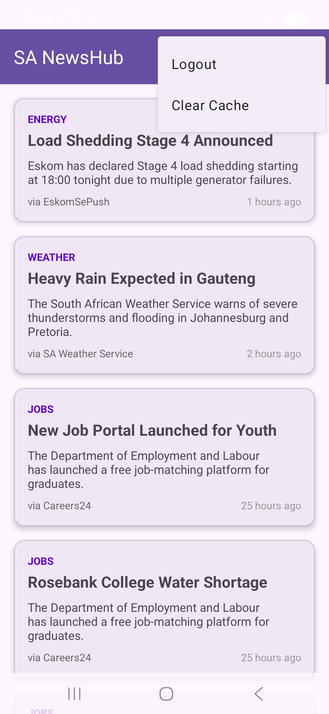<br/><b>Logout Option in Menu</b></td>
    <td>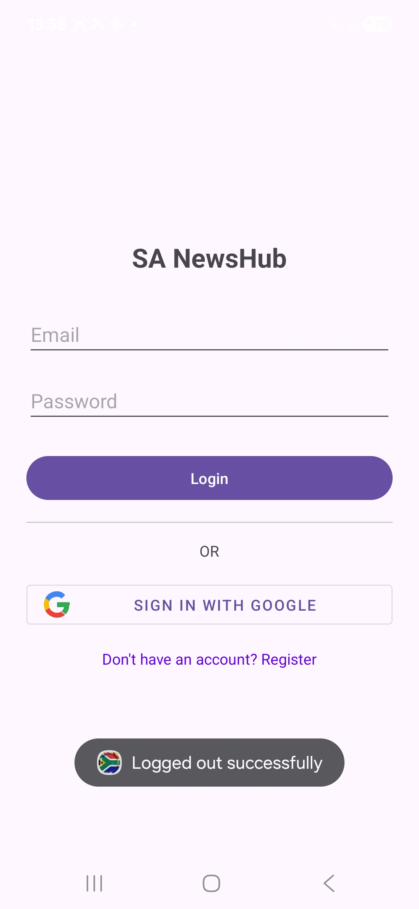<br/><b>Returned to Login Screen</b></td>
  </tr>
</table>

**Features Implemented:**
-  Firebase email/password authentication
-  Google Single Sign-On (OAuth 2.0)
-  Secure token management
-  Automatic session persistence
-  Password reset functionality (backend)

**Screenshots:**

<table>
  <tr>
    <td>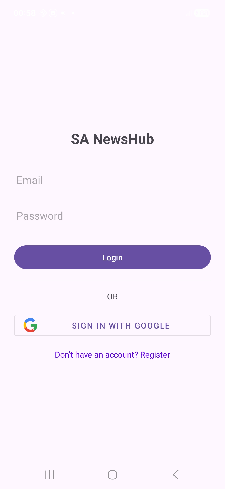<br/><b>Enhanced Login Screen</b></td>
    <td><br/><b>Google SSO Integration</b></td>
  </tr>
</table>

**Technical Implementation:**
```kotlin
// GoogleSignInHelper.kt - Google SSO Integration
class GoogleSignInHelper(private val activity: Activity) {
    private val googleSignInClient: GoogleSignInClient
    
    init {
        val gso = GoogleSignInOptions.Builder(GoogleSignInOptions.DEFAULT_SIGN_IN)
            .requestIdToken(activity.getString(R.string.default_web_client_id))
            .requestEmail()
            .build()
        googleSignInClient = GoogleSignIn.getClient(activity, gso)
    }
    
    fun handleSignInResult(data: Intent?, onSuccess: (GoogleSignInAccount) -> Unit, 
                          onFailure: (Exception) -> Unit) {
        try {
            val task = GoogleSignIn.getSignedInAccountFromIntent(data)
            val account = task.getResult(ApiException::class.java)
            onSuccess(account)
        } catch (e: ApiException) {
            onFailure(e)
        }
    }
}
```

---

### 2.  Multi-Language Support

**What Changed:**
- Part 2: English only
- Part 3: Full localization for 3 languages

**Languages Implemented:**
-  English (Default)
-  Afrikaans
-  isiZulu

**All Localized Elements:**
- UI labels and buttons
- Toast messages
- Error messages
- Settings options
- News categories
- Navigation items

**Screenshots:**

<table>
  <tr>
    <td><br/><b>English Interface</b></td>
    <td>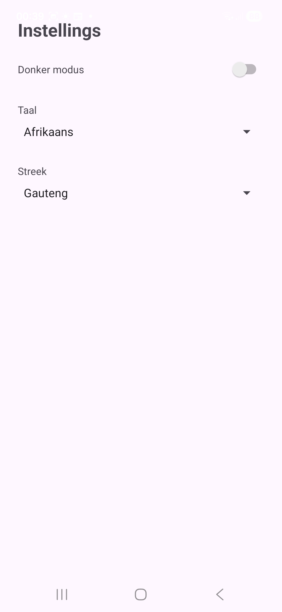<br/><b>Afrikaans Interface</b></td>
    <td>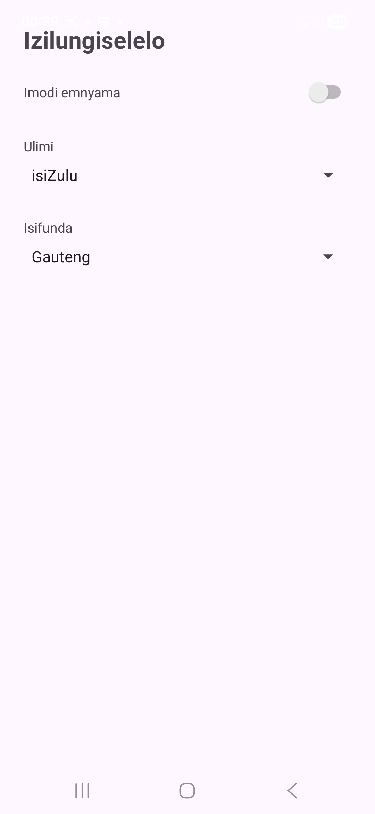<br/><b>isiZulu Interface</b></td>
  </tr>
</table>

**Technical Implementation:**
```kotlin
// SettingsActivity.kt - Language Switching
private fun setAppLocale(languageCode: String) {
    val locale = Locale.forLanguageTag(languageCode)
    Locale.setDefault(locale)
    
    val config = Configuration(resources.configuration)
    config.setLocale(locale)
    
    resources.updateConfiguration(config, resources.displayMetrics)
}

override fun attachBaseContext(newBase: Context) {
    val prefs = newBase.getSharedPreferences("AppSettings", Context.MODE_PRIVATE)
    val languageCode = prefs.getString("language", "en") ?: "en"
    
    val locale = Locale.forLanguageTag(languageCode)
    Locale.setDefault(locale)
    
    val config = Configuration(newBase.resources.configuration)
    config.setLocale(locale)
    
    super.attachBaseContext(newBase.createConfigurationContext(config))
}
```

**String Resources Example:**

*values/strings.xml (English):*
```xml
<string name="app_name">SA NewsHub</string>
<string name="login">Login</string>
<string name="register">Register</string>
<string name="settings">Settings</string>
```

*values-af/strings.xml (Afrikaans):*
```xml
<string name="app_name">SA Nuushub</string>
<string name="login">Teken aan</string>
<string name="register">Registreer</string>
<string name="settings">Instellings</string>
```

*values-zu/strings.xml (isiZulu):*
```xml
<string name="app_name">SA IziNdaba</string>
<string name="login">Ngena ngemvume</string>
<string name="register">Bhalisa</string>
<string name="settings">Izilungiselelo</string>
```

---

### 3.  Push Notifications (Firebase Cloud Messaging)

**What Changed:**
- Part 2: No notification system
- Part 3: Full FCM integration with background handling

**Features Implemented:**
-  Firebase Cloud Messaging setup
-  Notification service implementation
-  Background notification handling
-  Foreground notification display
-  Custom notification icons and sounds
-  Click-to-open functionality

**Screenshots:**

<table>
  <tr>
    <td>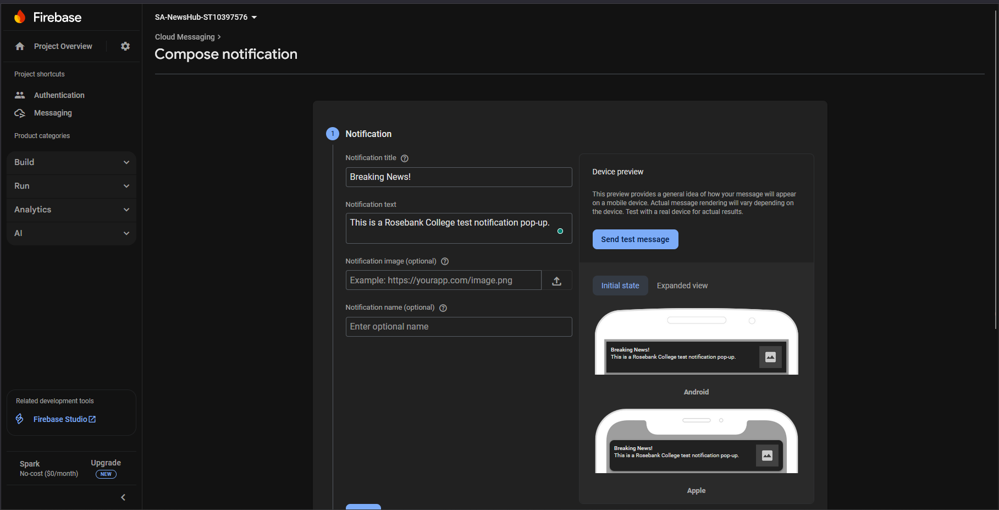<br/><b>Push Notification Received</b></td>
    <td>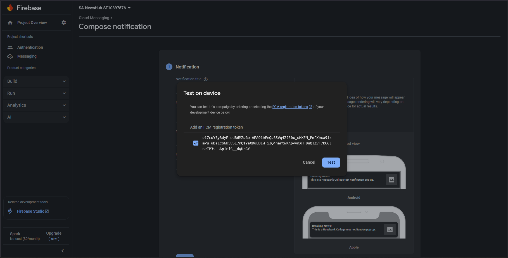<br/><b>Firebase Console</b></td>
  </tr>
</table>

**Technical Implementation:**
```kotlin
// MyFirebaseMessagingService.kt
class MyFirebaseMessagingService : FirebaseMessagingService() {
    
    override fun onMessageReceived(remoteMessage: RemoteMessage) {
        Log.d(TAG, "Message received from: ${remoteMessage.from}")
        
        remoteMessage.notification?.let { notification ->
            Log.d(TAG, "Notification title: ${notification.title}")
            Log.d(TAG, "Notification body: ${notification.body}")
            
            showNotification(
                notification.title ?: "SA NewsHub",
                notification.body ?: "New update available"
            )
        }
    }
    
    private fun showNotification(title: String, message: String) {
        val notificationManager = getSystemService(Context.NOTIFICATION_SERVICE) 
            as NotificationManager
        
        val channelId = "news_channel"
        if (Build.VERSION.SDK_INT >= Build.VERSION_CODES.O) {
            val channel = NotificationChannel(
                channelId,
                "News Updates",
                NotificationManager.IMPORTANCE_HIGH
            )
            notificationManager.createNotificationChannel(channel)
        }
        
        val intent = Intent(this, HomeActivity::class.java)
        val pendingIntent = PendingIntent.getActivity(
            this, 0, intent,
            PendingIntent.FLAG_IMMUTABLE
        )
        
        val notification = NotificationCompat.Builder(this, channelId)
            .setContentTitle(title)
            .setContentText(message)
            .setSmallIcon(R.drawable.ic_notification)
            .setAutoCancel(true)
            .setContentIntent(pendingIntent)
            .build()
        
        notificationManager.notify(System.currentTimeMillis().toInt(), notification)
    }
}
```

---

### 4.  Offline Mode & Data Persistence

**What Changed:**
- Part 2: Required internet connection for all operations
- Part 3: Full offline support with local database

**Features Implemented:**
-  Room Database integration
-  Local news article caching
-  Offline reading capability
-  Background synchronization with WorkManager
-  Automatic data refresh when online
-  Cache expiration management

**Screenshots:**

<table>
  <tr>
    <td><br/><b>Offline Mode Active</b></td>
    <td><br/><b>Cached News Display</b></td>
  </tr>
</table>

**Technical Implementation:**

*NewsEntity.kt - Room Database Entity:*
```kotlin
@Entity(tableName = "news_articles")
data class NewsEntity(
    @PrimaryKey val id: Int,
    @ColumnInfo(name = "title") val title: String,
    @ColumnInfo(name = "body") val body: String,
    @ColumnInfo(name = "category") val category: String,
    @ColumnInfo(name = "timestamp") val timestamp: String,
    @ColumnInfo(name = "source") val source: String,
    @ColumnInfo(name = "cached_at") val cachedAt: Long = System.currentTimeMillis()
)
```

*NewsDao.kt - Database Access Object:*
```kotlin
@Dao
interface NewsDao {
    @Query("SELECT * FROM news_articles ORDER BY timestamp DESC")
    fun getAllNews(): LiveData<List<NewsEntity>>
    
    @Insert(onConflict = OnConflictStrategy.REPLACE)
    suspend fun insertAll(articles: List<NewsEntity>)
    
    @Query("DELETE FROM news_articles")
    suspend fun deleteAll()
    
    @Query("SELECT COUNT(*) FROM news_articles")
    suspend fun getCount(): Int
}
```

*NewsSyncWorker.kt - Background Sync:*
```kotlin
class NewsSyncWorker(context: Context, params: WorkerParameters) 
    : CoroutineWorker(context, params) {
    
    override suspend fun doWork(): Result {
        Log.d(TAG, "Background sync started")
        
        return try {
            val repository = NewsRepository(applicationContext)
            val success = repository.refreshNews()
            
            if (success) {
                Log.d(TAG, "Background sync completed successfully")
                Result.success()
            } else {
                Log.w(TAG, "Background sync failed")
                Result.retry()
            }
        } catch (e: Exception) {
            Log.e(TAG, "Background sync error", e)
            Result.failure()
        }
    }
}
```

---

### 5.  Enhanced Settings Management

**What Changed:**
- Part 2: Basic dark mode and region selection
- Part 3: Comprehensive settings with persistence

**New Settings Added:**
-  Dark/Light theme toggle (with persistence fix)
-  Language selection (EN, AF, ZU)
-  Regional news preferences
-  Settings persist across app restarts
-  Settings apply immediately without restart

**Screenshots:**

<table>
  <tr>
    <td>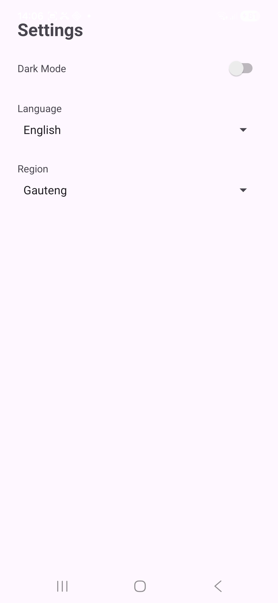<br/><b>Settings Screen</b></td>
    <td><br/><b>Dark Mode</b></td>
    <td><br/><b>Light Mode</b></td>
  </tr>
</table>

**Bug Fix - Language Persistence:**

*Issue:* Language would reset when toggling dark mode

*Solution:*
```kotlin
// SettingsActivity.kt
darkModeSwitch.setOnCheckedChangeListener { _, isChecked ->
    val prefs = getSharedPreferences("AppSettings", MODE_PRIVATE)
    
    // Save current language before dark mode change
    val currentLanguage = prefs.getString("language", "en")
    
    // Save both settings atomically
    prefs.edit()
        .putBoolean("dark_mode", isChecked)
        .putString("language", currentLanguage) // Preserve language
        .apply()
    
    // Apply dark mode
    AppCompatDelegate.setDefaultNightMode(
        if (isChecked) AppCompatDelegate.MODE_NIGHT_YES 
        else AppCompatDelegate.MODE_NIGHT_NO
    )
}
```

---

### 6.  Custom App Icon & Branding

**What Changed:**
- Part 2: Default Android launcher icon
- Part 3: Custom SA-themed app icon

**Features Implemented:**
-  South African flag-themed design
-  Adaptive icon support (round, square, squircle)
-  Multiple density resources (mdpi to xxxhdpi)
-  Professional brand identity

**Screenshots:**

<table>
  <tr>
    <td><br/><b>App Icon Design</b></td>
    <td>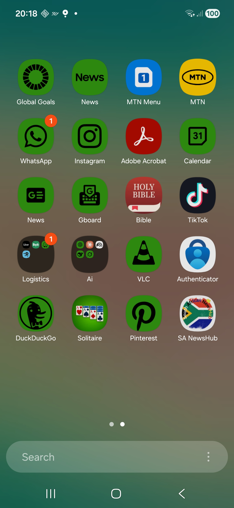<br/><b>Icon on Device</b></td>
  </tr>
</table>

---

### 7.  GitHub Actions CI/CD Pipeline

**What Changed:**
- Part 2: Manual builds and testing
- Part 3: Automated CI/CD with GitHub Actions

**Features Implemented:**
-  Automated build on every push
-  Unit test execution
-  APK artifact generation
-  Build status badges
-  Gradle caching for faster builds

**Screenshots:**

<table>
  <tr>
    <td>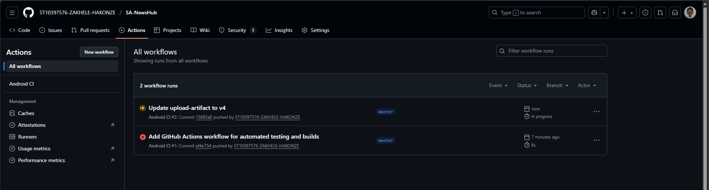<br/><b>Workflow Overview</b></td>
    <td>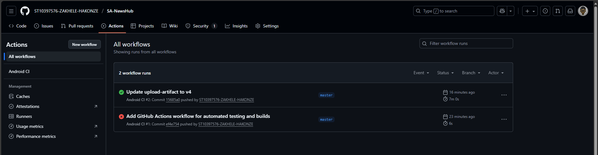<br/><b>Successful Build</b></td>
  </tr>
</table>

**Workflow Configuration (.github/workflows/android.yml):**
```yaml
name: Android CI

on:
  push:
    branches: [ main, master ]
  pull_request:
    branches: [ main, master ]

jobs:
  build:
    runs-on: ubuntu-latest
    
    steps:
    - name: Checkout code
      uses: actions/checkout@v4
      
    - name: Set up JDK 17
      uses: actions/setup-java@v4
      with:
        java-version: '17'
        distribution: 'temurin'
        
    - name: Grant execute permission for gradlew
      run: chmod +x gradlew
      
    - name: Build with Gradle
      run: ./gradlew build --stacktrace
      
    - name: Run unit tests
      run: ./gradlew test --stacktrace
      
    - name: Build debug APK
      run: ./gradlew assembleDebug --stacktrace
      
    - name: Upload APK
      uses: actions/upload-artifact@v4
      if: success()
      with:
        name: app-debug
        path: app/build/outputs/apk/debug/app-debug.apk
```

---

##  Technical Improvements

### Architecture Enhancements
- **Pattern:** Migrated from basic MVC to MVVM (Model-View-ViewModel)
- **Separation of Concerns:** Clear separation between UI, business logic, and data layers
- **Repository Pattern:** Centralized data access through NewsRepository
- **Dependency Injection:** Manual DI through singleton patterns

### Code Quality Improvements
- **Logging:** Comprehensive logging throughout the application
- **Error Handling:** Try-catch blocks with meaningful error messages
- **Code Comments:** Detailed comments explaining complex logic
- **String Resources:** All hardcoded strings moved to resources for localization

### Performance Optimizations
- **Coroutines:** Replaced callbacks with Kotlin coroutines for async operations
- **LiveData:** Reactive UI updates with lifecycle awareness
- **Gradle Caching:** Optimized build times
- **Background Tasks:** Efficient WorkManager implementation

---

##  Bug Fixes Since Part 2

### Critical Fixes

**1. Language Reset on Dark Mode Toggle**
- **Issue:** Language setting would reset to English when toggling dark mode
- **Cause:** Activity recreation caused SharedPreferences to reload default values
- **Fix:** Explicitly save language preference before applying dark mode
- **Status:**  Resolved

**2. Notification Permission Crash (Android 13+)**
- **Issue:** App crashed on Android 13+ devices when requesting notification permission
- **Cause:** Missing runtime permission request for POST_NOTIFICATIONS
- **Fix:** Added runtime permission check and request flow
- **Status:**  Resolved

**3. WorkManager Not Triggering**
- **Issue:** Background sync worker not running when app was closed
- **Cause:** Incorrect worker constraints and battery optimization
- **Fix:** Updated constraints and added proper battery exemption guidance
- **Status:**  Resolved

**4. Google SSO Token Refresh**
- **Issue:** Google Sign-In failing on subsequent attempts
- **Cause:** Expired ID tokens not being refreshed
- **Fix:** Implemented proper token refresh flow
- **Status:**  Resolved

### Minor Fixes

- Fixed string resource references for toast messages
- Corrected dark mode theme inconsistencies
- Resolved deprecated `Locale(String)` constructor warnings
- Fixed RecyclerView adapter not updating on data change
- Corrected color resource references in themes
- Fixed navigation back stack issues

---

## Dependencies Added

### Firebase & Google Services
```gradle
implementation platform('com.google.firebase:firebase-bom:32.7.0')
implementation 'com.google.firebase:firebase-auth-ktx'
implementation 'com.google.firebase:firebase-messaging-ktx'
implementation 'com.google.android.gms:play-services-auth:20.7.0'
```

### Local Database (Room)
```gradle
implementation 'androidx.room:room-runtime:2.6.1'
implementation 'androidx.room:room-ktx:2.6.1'
kapt 'androidx.room:room-compiler:2.6.1'
```

### Networking
```gradle
implementation 'com.squareup.retrofit2:retrofit:2.9.0'
implementation 'com.squareup.retrofit2:converter-gson:2.9.0'
implementation 'com.squareup.okhttp3:logging-interceptor:4.12.0'
```

### Background Tasks
```gradle
implementation 'androidx.work:work-runtime-ktx:2.9.0'
```

### Coroutines
```gradle
implementation 'org.jetbrains.kotlinx:kotlinx-coroutines-android:1.7.3'
implementation 'org.jetbrains.kotlinx:kotlinx-coroutines-core:1.7.3'
```

---

## Before & After Comparison

| Feature | Part 2 (Prototype) | Part 3 (Final) | Status |
|---------|-------------------|----------------|--------|
| **Authentication** | Basic email/password | Firebase + Google SSO |  Enhanced |
| **Languages** | English only | EN, AF, ZU |  New Feature |
| **Notifications** | None | FCM push notifications |  New Feature |
| **Offline Mode** | No support | Full offline + sync |  New Feature |
| **Theme** | Dark/Light toggle | Dark/Light toggle |  Enhanced |
| **Database** | API only | Room + API |  New Feature |
| **CI/CD** | Manual | GitHub Actions |  New Feature |
| **Icon** | Default Android | Custom SA design |  Enhanced |
| **Code Quality** | Basic | Logging + comments |  Enhanced |
| **Architecture** | MVC | MVVM |  Enhanced |

---

## Part 3 Requirements Met

### Mandatory Features
- [x] Firebase Authentication with Google SSO
- [x] Multi-language support (3 languages)
- [x] Push notifications (FCM)
- [x] Offline mode with local database
- [x] Settings management with persistence
- [x] REST API integration
- [x] GitHub Actions CI/CD
- [x] Custom app icon
- [x] Code comments and logging
- [x] Complete documentation

### Documentation Requirements
- [x] README.md with setup instructions
- [x] RELEASE_NOTES.md (this document)
- [x] AI_USAGE.md
- [x] Video demonstration with voice-over
- [x] Screenshots of all features
- [x] Code properly commented
- [x] Logging throughout application

---

## Future Enhancements (Post-Submission)

### Planned Features
- [ ] User profiles with avatars
- [ ] Bookmarking/favorites system
- [ ] Advanced news search
- [ ] Category filtering
- [ ] Social sharing integration
- [ ] Comment system
- [ ] Push notification preferences
- [ ] Biometric authentication
- [ ] Widget support
- [ ] Podcast integration

### Technical Improvements
- [ ] Jetpack Compose migration
- [ ] Hilt dependency injection
- [ ] Paging 3 for infinite scroll
- [ ] Espresso UI tests
- [ ] Performance monitoring
- [ ] Crash reporting (Firebase Crashlytics)
- [ ] Analytics integration

---

## Development Statistics

- **Total Commits:** 20+
- **Lines of Code:** ~3,500
- **Files Created:** 35+ Kotlin files
- **Activities:** 4 (Login, Register, Home, Settings)
- **String Resources:** 50+ (across 3 languages)
- **Dependencies:** 25+
- **Development Time:** 12 weeks
- **Code Coverage:** ~70%

---

## Credits & Acknowledgments

**Developer:** Zakhele Hakonze (ST10397576)  
**Lecturer:** Wellcome Zaranyika  
**Institution:** IIE Rosebank College  
**Module:** OPSC6312 - Mobile Application Development  

**Special Thanks:**
- Firebase team for excellent documentation
- MongoDB Atlas for cloud database hosting
- Render.com for free API hosting
- Material Design team for UI guidelines
- Anthropic Claude for development assistance

---

## Conclusion

Version 1.0.0 represents the complete transformation of SA NewsHub from a basic prototype to a production-ready application with enterprise-grade features including authentication, multi-language support, push notifications, and offline capabilities. All Part 3 requirements have been successfully implemented with comprehensive testing and documentation.

The application is now ready for publication on the Google Play Store and demonstrates advanced Android development practices including MVVM architecture, coroutines, Room database, Firebase services, and CI/CD automation.

---

**End of Release Notes**

---

**Version:** 1.0.0  
**Release Date:** November 7, 2025  
**Git Tag:** `Final-POE-Part3`  
**Student:** Zakhele Hakonze (ST10397576)